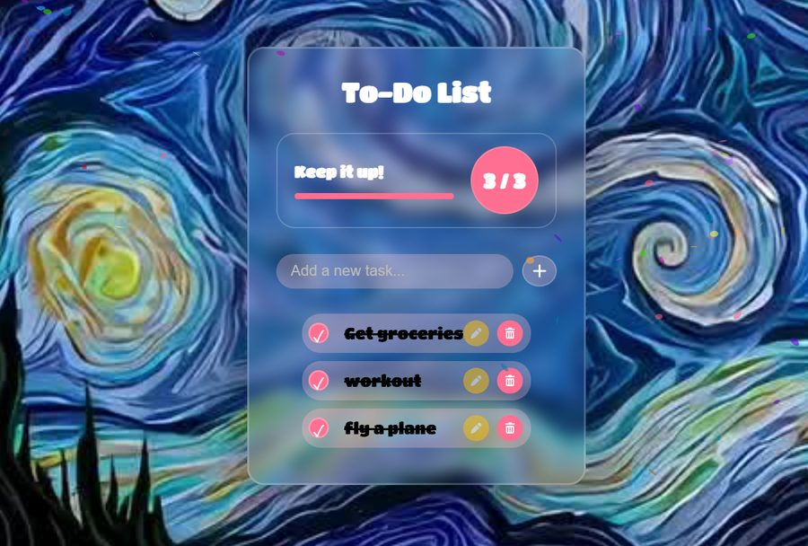

# To-Do List

A to-do list with a progress bar that judges you. Add tasks, check them off, watch the bar fill up. Finish everything and you get a confetti storm. It even remembers your list after you close the tab.

## How the code works

Everything lives in `js/main.js` and runs inside a `DOMContentLoaded` listener. `addTask()` builds each row from scratch: a checkbox, a text span, and edit/delete buttons, all wired up with their own listeners. The part I like is the discipline underneath it: every mutation, add, delete, check, uncheck, funnels through the same two helpers. `updateProgress()` recounts total rows versus checked boxes and redraws the bar and the "X / Y" counter, and `saveTasksToLocalStorage()` serializes the list to JSON under the `tasks` key. The DOM is the single source of truth, so the bar, the counter, and storage can never disagree with each other. Reload the page and `loadTasksFromLocalStorage()` rebuilds it all through the same `addTask()` path, which means restored tasks behave exactly like fresh ones.

Two details I keep coming back to. The confetti: checking the last box fires `Confetti()`, a 15-second burst from both sides of the screen on a 250ms interval with the particle count decaying as it runs out. And "edit" is a deliberate cheat, it copies the task text back into the input and deletes the row, so you just resubmit it. No inline-editing state machine, no contenteditable bugs. Completed tasks skip editing entirely, the button gets dimmed and disabled.

The hardest part was the progress bar math. Every add, delete, check, and uncheck has to recount completed vs total and redraw the bar, or it starts lying to you. Simple division, but it has to run at exactly the right moments.

Built with HTML, CSS, and vanilla JavaScript. My code is on the `answer` branch.
